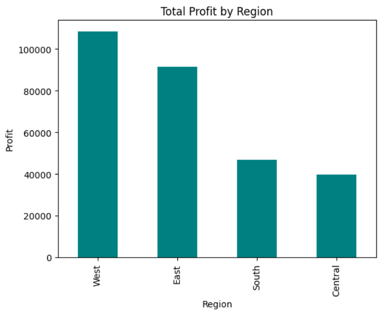
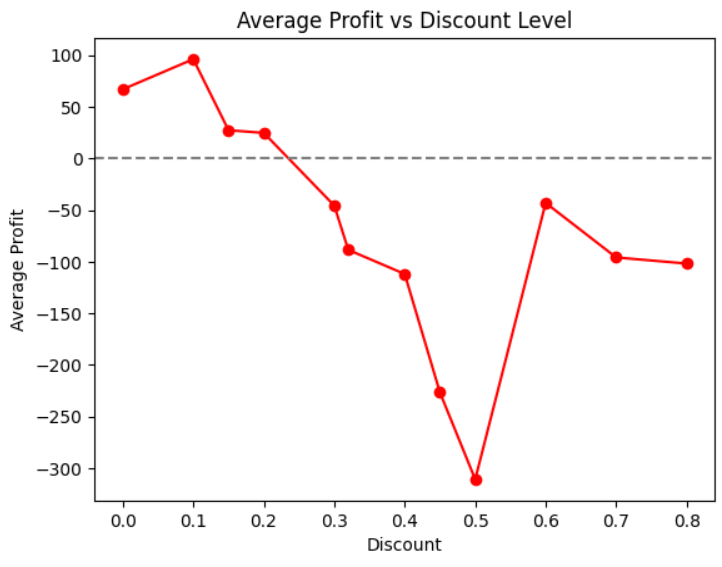
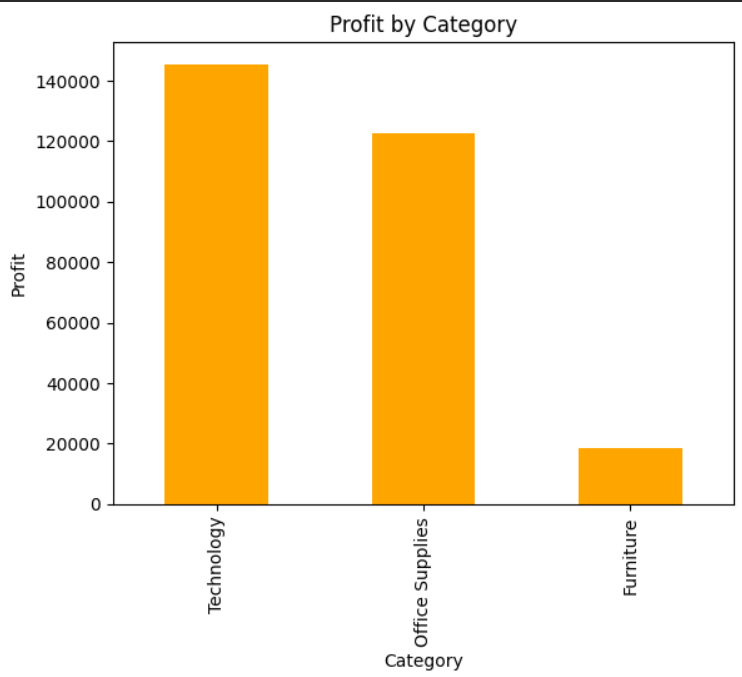
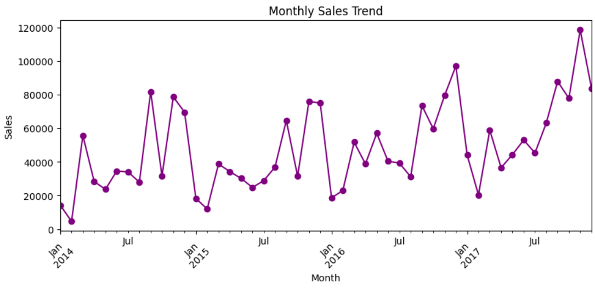

# Retail Sales Analysis - Python & Pandas

Analysis of retail sales data to uncover regional performance, category 
profitability, discount impact, and seasonal sales trends using Python 
and Pandas.

## Dataset
Superstore Sales dataset (Kaggle) - contains order-level retail 
transaction data including Sales, Profit, Discount, Region, Category, 
Sub-Category, Ship Mode, and Segment (9,994 rows, 21 columns).

## Tools Used
- Python (Pandas, Matplotlib)
- Google Colab

## What I Did
- Loaded and explored the dataset (`.info()`, `.describe()`, null checks)
- Checked for missing values and duplicate records
- Answered 7 business questions using groupby analysis
- Visualized key trends using bar and line charts

## Key Business Questions & Insights

**1. Which region generates the highest Sales and Profit?**
The West region generates the highest profit (₹1,08,418), followed by 
East (₹91,522). Central lags behind at ₹39,706 despite decent sales 
volume (₹5,01,239), suggesting pricing or cost inefficiencies in that 
region worth investigating.

**2. Which product category is most profitable?**
Technology drives the most profit (₹1,45,454), closely followed by 
Office Supplies (₹1,22,490). Furniture trails far behind at ₹18,451, 
indicating thinner margins or heavier discounting on furniture items.

**3. Does higher discount lead to lower profit?**
Profit stays healthy up to a 20% discount, but beyond 30%, average 
profit turns negative and worsens sharply (down to -₹310 at 50% 
discount). The business should avoid discounts above 20-25% unless 
strategically necessary.

**4. Which Sub-Category should the business focus on more?**
Copiers generate the highest profit (₹55,617), followed by Phones and 
Accessories. Tables show a significant loss (-₹17,725), with Bookcases 
and Supplies also unprofitable — these items likely need reduced 
discounting or a pricing review.

**5. Does Ship Mode affect profit?**
First Class shipments show the highest average profit (₹31.84), while 
Standard Class shows the lowest (₹27.49). The difference is modest, 
suggesting shipping mode has only a small effect on profitability 
compared to factors like discount and category.

**6. Which customer segment contributes the most profit?**
The Consumer segment contributes the most profit (₹1,34,119), making it 
the priority segment for retention and targeted offers. Home Office 
contributes the least (₹60,298), suggesting a need for a different 
pricing or marketing strategy there.

**7. Monthly Sales Trend (seasonality)**
November and December consistently rank among the highest sales months 
across multiple years (2014-2017), with November 2017 recording the 
peak (₹1,18,447). This points to a clear holiday-season demand pattern 
— the business should plan inventory buildup and marketing ahead of Q4 
each year.

## Charts

## How to Run
1. Clone this repo
2. Open `superstoredata_analysis.ipynb` in Google Colab or Jupyter
3. Upload `superstore_data.csv` and run all cells
